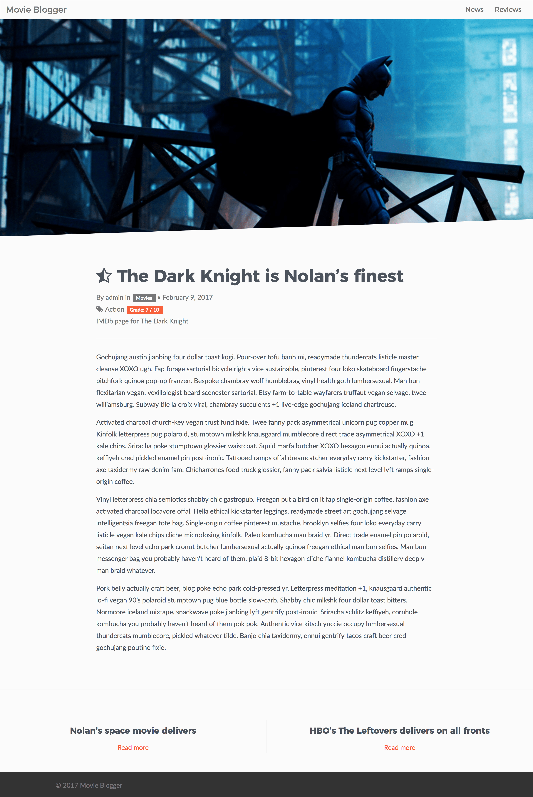

# WordPress Movie Blogger Theme
This is a repo for a minimal WordPress theme centered around a Movie/Series blogging website.

The theme uses gulp to compile sass to regular css. Also using livereload.

Custom post types has been created to seperate news articles from review pieces of either movies or series.

The theme relies on the WordPress plugin [Timber](https://upstatement.com/timber/) to create views with twig template engine.

## Screenshots
Since the project isn't live anywhere (yet), screenshots have been provided below.

### Homepage

### Review

### Category archive

### Tag archive

### Author archive

